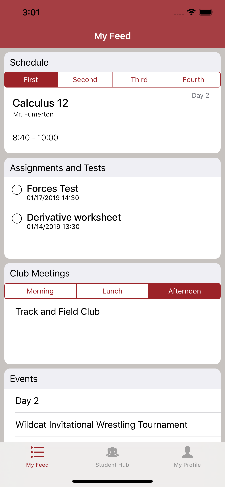
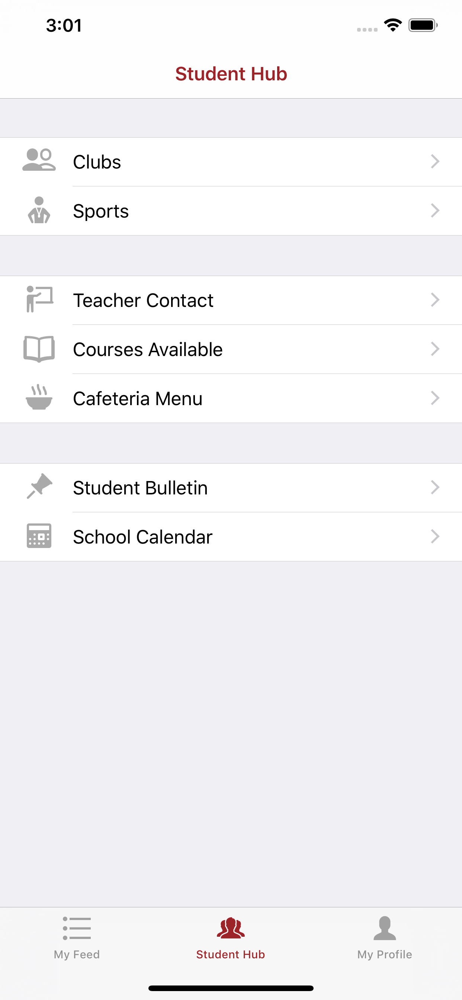
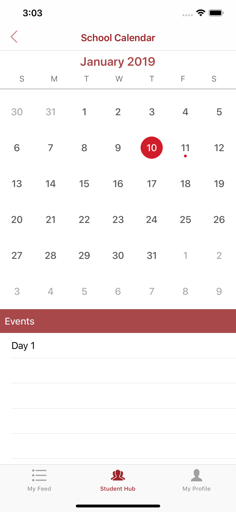
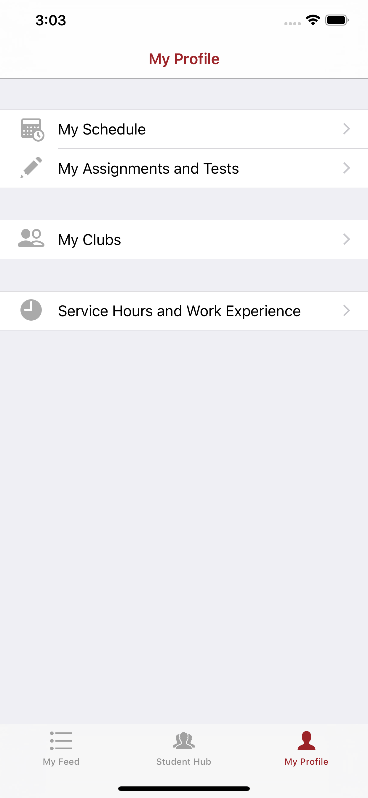
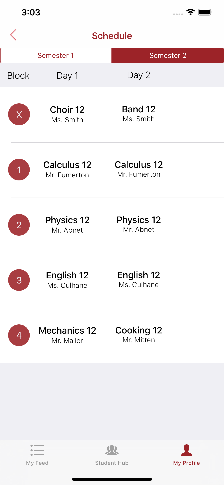

# BCSS

The iOS application for Burnaby Central Secondary School, currently used by over 450 students.
You can download the app at: https://apps.apple.com/ca/app/bcss-wildcats/id1444820091

# About

The BCSS Wildcats app is a smart planner that helps students manage their schedule, academic life, and extracurriculars all in one app. Students are also able to access realtime updated information on teachers, events, student activities, and more.

# My Feed

By using My Feed, students can see their whole day in a glance.

**Features**
* Showcases the course schedule of the day and notifies for Flex Time
* Lists the student's club meetings of the day in terms of time of day
* Lists the school events of the day

# Student Hub

Students can find all student life related information here.

 
**Features**
* Shows current available club/sports that students can join through the app and add to the student's in-app list of clubs/sports
* Lists teacher contacts that students can use with in-app emailing
* Lists of the available courses you can take
* A regularly updated cafeteria menu
* Easy access to sign up for Flex Time
* A regularly updated student bulletin
* A school calendar that shows events happening at the school 

# School Calendar

Students can find all past, present, and upcoming events at the school.

**Features**
* Monthly calendar that students can interact with and check events for each day
* Students can check out details (e.g. location, date and time, description) for each event
* Shows schedule transition days and Flex days (e.g. Day 1, Day 2, and Day 0)

# My Profile

Students can edit and customize their feed and organize their academic life and extracurriculars.

**Features**
* Schedule that can be customized with courses based on blocks with details (name, teacher, and room)
* Lists assignments and tests that students will be notified about and students can create more assignments and edit currrent ones
* Keeps track of clubs you have joined and tracks the meetings for each club that will be showcased on the student's feed
* Keeps track of work experience hours and sums up the hours for the student

# My Schedule

Students can edit and save their schedule block by block for each semester.

**Features**
* Saves blocks of courses depending on semester with details such as name, teacher, and room number
* Sorts semesters based on current semester
* Allows students to customize schedule in terms of Day 1 and Day 2

